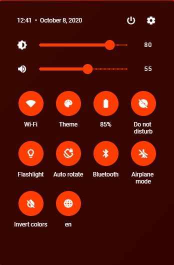
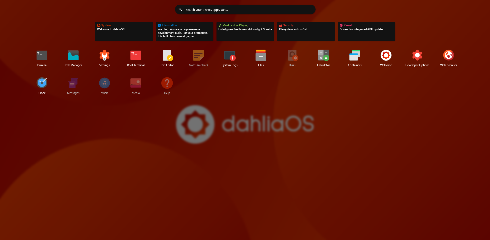
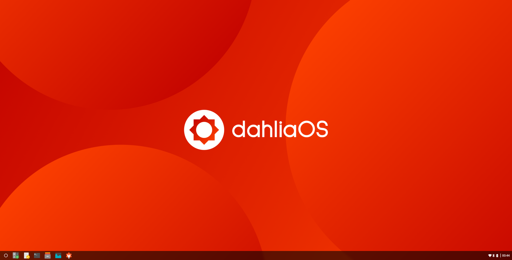
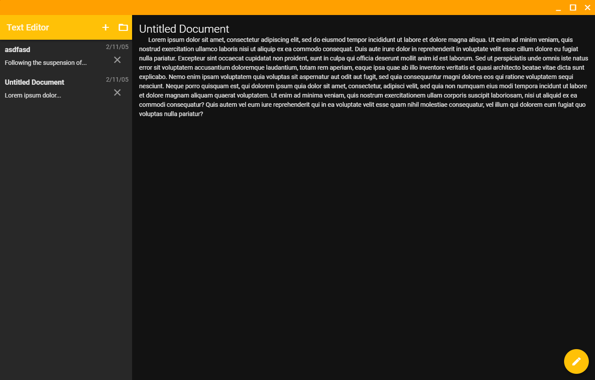

<!---

Copyright 2019 The dahliaOS Authors

Licensed under the Apache License, Version 2.0 (the "License");
you may not use this file except in compliance with the License.
You may obtain a copy of the License at

    http://www.apache.org/licenses/LICENSE-2.0

Unless required by applicable law or agreed to in writing, software
distributed under the License is distributed on an "AS IS" BASIS,
WITHOUT WARRANTIES OR CONDITIONS OF ANY KIND, either express or implied.
See the License for the specific language governing permissions and
limitations under the License.

-->

<p align="center">
  

<p align="center">
<a href="https://github.com/dahlia-os/pangolin-desktop">Pangolin</a> ●
<a href="https://dahliaos.io">Website</a> ●
<a href="https://discord.gg/7qVbJHR">Discord</a> ●
<a href="https://github.com/dahlia-os/releases">Releases</a> ●
<a href="https://paypal.me/officialdahliaos">Donate</a> ●
<a href="https://github.com/dahlia-os/documentation">Documentation</a>

# Introduction to Pangolin

Hey there, we're glad you're checking this document out!

In this file, we will document all of Pangolin's files and front-end code, explain what it changes, what specific code it is and on what line it is!

The purpose of this is to introduce Flutter to newbies and to hopefully boost their learning!

We will be updating this regurarly and we invite all Dart (and Flutter :D) developers to join our Discord where you can ask for help and learn!

# Navigation

* Folders
  * [Localization](https://github.com/dahlia-os/pangolin-desktop/tree/master/lib/utils/localization)
    * Contains everything regarded to localization (translations)
  * [Applications](https://github.com/dahlia-os/pangolin-desktop/tree/master/lib/applications)
    * Contains all dahliaOS applications
  * [Settings](https://github.com/dahlia-os/pangolin-desktop/tree/master/lib/desktop/settings)
    * Contains the Settings application
  * [dahliaOS Logos](https://github.com/dahlia-os/pangolin-desktop/tree/master/assets/images/dahliaOS/Logos)
    * Contains all dahliaOS logos (both PNGs and SVGs)
  * [Wallpapers](https://github.com/dahlia-os/pangolin-desktop/tree/master/assets/images/Desktop/Wallpapers)
    * Contains all wallpapers
  * [Icons](https://github.com/dahlia-os/pangolin-desktop/tree/master/assets/images/icons/v2)
    * Contains all icons (both PNGs and SVGs)
  * [Widgets](https://github.com/dahlia-os/pangolin-desktop/tree/master/lib/utils/widgets)
    * Contains all widgets

* Files
  * [main.dart](https://github.com/dahlia-os/pangolin-desktop/blob/master/lib/main.dart)
    * Contains translations and initializers
  * [desktop.dart](https://github.com/dahlia-os/pangolin-desktop/blob/master/lib/desktop/desktop.dart)
    * Contains the desktop framework with taskbar, window playground etc.
  * [quick_settings.dart](https://github.com/dahlia-os/pangolin-desktop/blob/master/lib/desktop/quicksettings/quick_settings.dart)
    * Contains the Quick settings framework
  * [launcher.dart](https://github.com/dahlia-os/pangolin-desktop/blob/master/lib/desktop/launcher/launcher.dart)
    * Contains the Launcher framework
* Icons
  * [Application icons](https://github.com/dahlia-os/pangolin-desktop/tree/master/assets/images/icons/v2)
  * [UI icons](https://github.com/dahlia-os/pangolin-desktop/tree/master/assets/images/icons/v2)
  * [dahliaOS logos](https://github.com/dahlia-os/pangolin-desktop/tree/master/assets/images/dahliaOS/Logos)
* Wallpapers
  * [Pangolin wallpapers](https://github.com/dahlia-os/pangolin-desktop/tree/master/assets/images/Desktop/Wallpapers)

* [Front-end code](https://github.com/SincerelyFaust/pangolin-desktop/blob/master/INTRODUCTION.md#front-end-code)
  * [Taskbar](https://github.com/SincerelyFaust/pangolin-desktop/blob/master/INTRODUCTION.md#taskbar)
  * [Quick settings](https://github.com/SincerelyFaust/pangolin-desktop/blob/master/INTRODUCTION.md#quick-settings)
  * [Launcher](https://github.com/SincerelyFaust/pangolin-desktop/blob/master/INTRODUCTION.md#launcher)
  * [Wallpaper](https://github.com/SincerelyFaust/pangolin-desktop/blob/master/INTRODUCTION.md#wallpaper)
  * [Window manager](https://github.com/SincerelyFaust/pangolin-desktop/blob/master/INTRODUCTION.md#window-manager)

# Front-end code

* Taskbar
  * [Taskbar file](https://github.com/dahlia-os/pangolin-desktop/blob/master/lib/desktop/desktop.dart)
  * Line xx to xx
* Quick settings
  * [Quick settings file](https://github.com/dahlia-os/pangolin-desktop/blob/master/lib/desktop/quicksettings/quick_settings.dart)
  * Line xx to xx
* Launcher
  * [Launcher file](https://github.com/dahlia-os/pangolin-desktop/blob/master/lib/desktop/launcher/launcher.dart)
  * Line xx to xx
* Wallpaper
  * [Wallpaper file](https://github.com/dahlia-os/pangolin-desktop/blob/master/lib/desktop/desktop.dart)
  * Line xx to xx
* Window manager
  * [Window manager folder](https://github.com/dahlia-os/pangolin-desktop/tree/master/lib/desktop/window)
  * Line xx to xx

## Taskbar

<p align="left">
  

* Transparency

```dart
code_goes_here
```

* Blur

```dart
code_goes_here
```

* Corner rounding

```dart
code_goes_here
```

## Quick settings

<p align="left">
  

* Transparency

```dart
code_goes_here
```

* Blur

```dart
code_goes_here
```

* Corner rounding

```dart
code_goes_here
```

## Launcher

<p align="left">
  

* Transparency

```dart
code_goes_here
```

* Blur

```dart
code_goes_here
```

* Corner rounding

```dart
code_goes_here
```

## Wallpaper

<p align="left">
  

* Transparency

```dart
code_goes_here
```

* Blur

```dart
code_goes_here
```

* Change wallpaper

```dart
code_goes_here
```


## Window manager

<p align="left">
  

* Transparency

```dart
code_goes_here
```

* Blur

```dart
code_goes_here
```

* Corner rounding

```dart
code_goes_here
```
